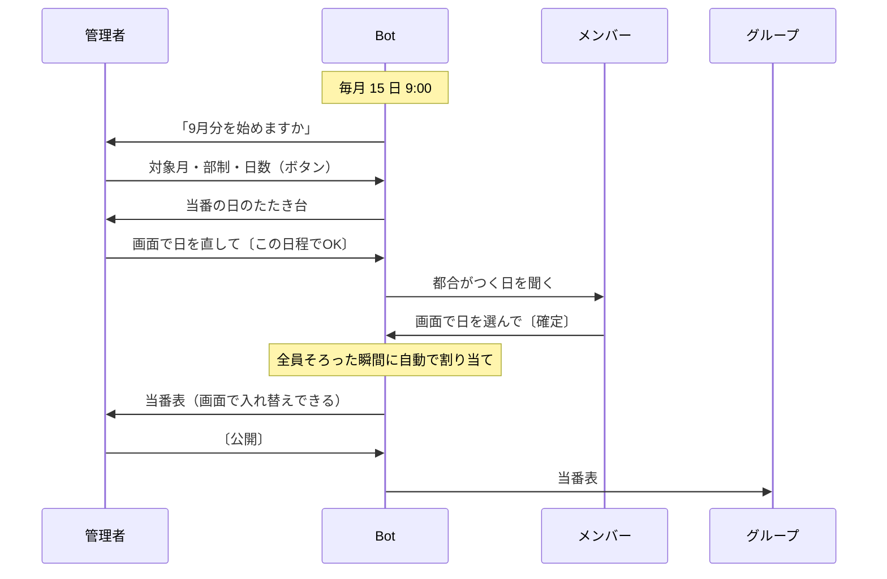

# 当番Bot

毎月の当番決めを LINE だけで済ませる Bot。都合がつく日を聞いて回り、担当を公平に割り振り、
当番表をグループに送る。管理者もメンバーも、押すのはボタンだけ。



## つくりの方針

サーバーもデータベースも使わず、Google Apps Script とスプレッドシート 1 つ、LINE Messaging API だけ。
**無料で動く・作った人がいなくても引き継げる・使う人が LINE 以外を触らない**。この 3 つを、
技術の面白さより優先しました。

- **無料に収める** — LINE の通数は送った相手の人数で数える。聞き取りは 1 人 1 通、連絡はグループへ 1 通、
  ボタンへの返事は数えられない reply（20 人で月 43〜63 通）。画面は webhook 用に公開済みの URL の
  GET 側を使い回すので、ホスティングも要らない
- **守りは「できないこと」から逆算** — GAS では HTTP ヘッダが読めず、LINE の署名を検証できない。
  webhook は合言葉つきの URL でしか受けず、画面をひらいた人は名簿の「鍵」で見分ける。鍵が漏れても、
  できるのはその人の回答の書き換えだけ。秘密はコードに書かず、スクリプト プロパティに置く
- **使う人はボタンしか押さない** — 文字は打たせない。管理者もメンバーの一人で、同じつくりの画面を使う

## 費用

すべて無料枠の中で動く。

| サービス | 料金 | 無料枠 | この Bot の使用量 |
|---|---|---|---|
| LINE Messaging API | コミュニケーションプラン（無料） | 月 200 通 | メンバー 20 人で月 43〜63 通ほど |
| GAS ウェブアプリ（日付と担当を選ぶ画面） | 無料 | リクエスト数の上限なし | 月 40 回ほど、合計 30 秒ほど |
| Google Apps Script | 無料 | 1 日あたり実行 90 分・トリガー 90 分・URL 取得 20,000 回 など | 1 日に数秒〜数十秒 |
| Google スプレッドシート | 無料 | — | シート 1 つ |

LINE の通数は「送った相手の人数」で数える（グループに 1 通送ると在籍人数分）。ボタンへの返事（reply）は数えない。
目安としてメンバー 60 人あたりまでは無料枠に収まる。

根拠：
- [LINE Messaging API の料金](https://developers.line.biz/ja/docs/messaging-api/pricing/) — 通数の数え方、reply が無料であること
- [LINE 公式アカウント 料金プラン](https://www.lycbiz.com/jp/service/line-official-account/plan/) — コミュニケーションプラン 200 通/月
- [Google Apps Script の割り当て](https://developers.google.com/apps-script/guides/services/quotas) — 無料アカウントの 1 日あたりの上限

## GAS に貼るコードを作る

GAS のエディタにはフォルダを置けないので、`src/` の 13 ファイルを 1 枚にまとめる。

```sh
node tools/bundle.js          # dist/コード.gs を作る
node tools/bundle.js --check  # src/ とずれていないか見る
```

できた `dist/コード.gs` を GAS の `コード.gs` にまるごと貼る。**コードは書き換えない**。

スプレッドシート ID とチャネルアクセストークンは、GAS エディタの〔プロジェクトの設定〕→
〔スクリプト プロパティ〕に入れる。

| プロパティ | 値 |
|---|---|
| `SPREADSHEET_ID` | スプレッドシートの URL の `/d/` と `/edit` の間 |
| `CHANNEL_ACCESS_TOKEN` | LINE Developers → Messaging API 設定 → チャネルアクセストークン（長期） |

コードに書かないのは、隠すためではない（スクリプトを開ける人はプロパティも読める）。直すたびに
`dist/コード.gs` を貼り直す作りなので、コードに書くと**貼り直すたびに 2 行を入れ直す**ことになり、
入れ忘れれば全部落ち、古いトークンを貼れば LINE だけが黙る。プロパティなら貼り直しても消えない。

`dist/` は Git に入れていない。`src/` から作れるものなので、貼る直前に生成する。

貼ったあとは**ウェブアプリとしてデプロイし、`setup()` を実行する**（webhook と画面が同じ URL）。
プロパティが空のままだと、`setup()` は「スクリプト プロパティ「SPREADSHEET_ID」が空です」と
言って止まる。

直すときは「新しいデプロイ」ではなく**既存デプロイの編集**にすること。新しく作ると URL が
変わり、メンバーに配ってある画面の URL がすべて死ぬ。

LINE に登録する Webhook URL は、末尾に合言葉を付けた `…/exec?w=（合言葉）`。合言葉は
`setup()` が作り、実行ログと `設定` シートに出る。**`/dev` で終わる URL は使えない**
（自分が Google にログインしているときしか開けないので、LINE から届かない）。

## テスト

```sh
node test/logic.test.js   # 当番の日と割り当てを 3 通りの方法で検算
node test/e2e.test.js     # 導入から公開までを通しで動かす
node test/bundle.test.js  # dist が src とずれていないか
bash test/mutation.sh     # コードをわざと壊してテストが落ちるか
```

割り当ては総当たり・動的計画法・下限つき流量の 3 通りで検算する。`mutation.sh` はコードをわざと
114 か所壊し、すべてテストが落ちることを見る（見逃し 0）。
`e2e` は LINE のイベントとウェブ画面の両方を通す。画面のなかの JavaScript も、生成した
HTML から取り出して DOM のまねの上で走らせ、組み立てた形と押したときの動きを見ている。

## 文書

- [仕様](docs/design.md)
- [運用マニュアル](docs/運用マニュアル.html) — 管理者向け
- [デプロイ手順](docs/デプロイ手順.html)
