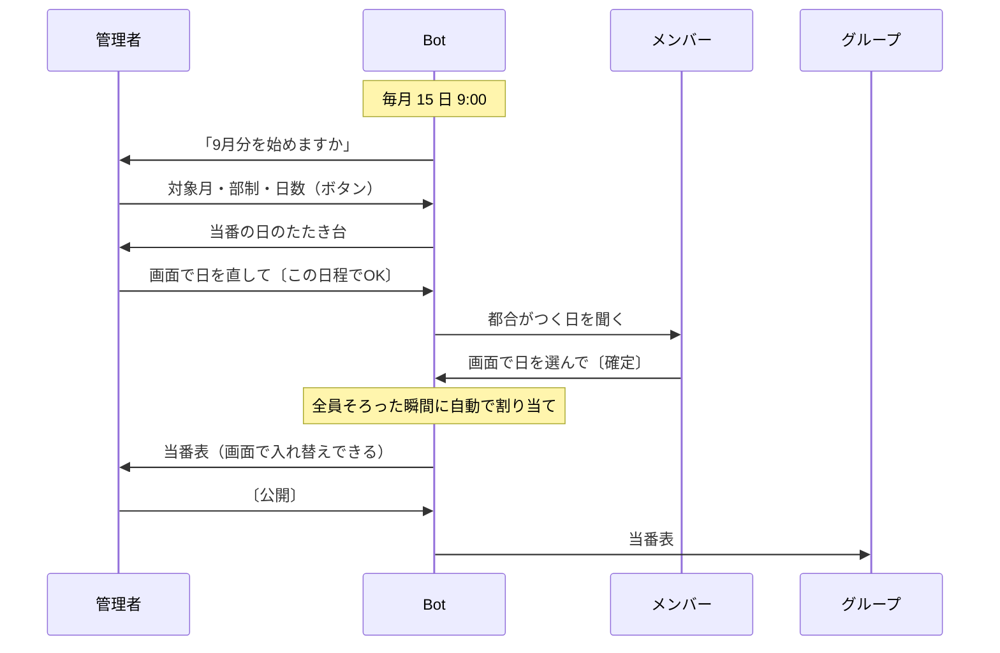
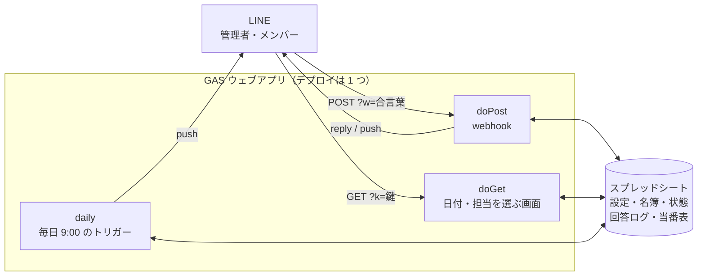

# 当番Bot

毎月の当番決めを LINE だけで済ませる Bot。都合がつく日を聞いて回り、担当を公平に割り振り、
当番表をグループに送る。管理者もメンバーも、押すのはボタンだけ。



## つくりの方針

使う人には高齢の方もいる。だから**文字を打たせない**。押すのはボタンと、カレンダーの日を
タップするだけ。アプリの追加も、アカウント登録も、URL の入力もない。管理者も同じで、
日程も担当もメンバーと同じつくりの画面で選ぶ。

- **素人が運用できる** — 中身はスプレッドシートに全部出ている。おかしくなってもセルを直せば戻る。
  サーバーもデータベースも無く、コードは GAS に 1 枚貼るだけ（[デプロイ手順](docs/デプロイ手順.html)）。
  日付や締切の変更は、シートを書き換えれば再デプロイなしで効く
- **無料に収める** — 20 人で月 1 回という使い方に合わせて選んだ。一斉 push を避け、画面も
  webhook 用の URL を使い回すことで、LINE も GAS も無料枠の内側に収まる（[費用](#費用)）
- **守りは「できないこと」から逆算** — GAS では HTTP ヘッダが読めず、LINE の署名を検証できない。
  webhook は合言葉つきの URL でしか受けず、画面をひらいた人は名簿の「鍵」で見分ける。鍵が漏れても、
  できるのはその人の回答の書き換えだけ。秘密はコードに書かず、スクリプト プロパティに置く

## 構成

URL は 1 つだけ。**POST が webhook、GET が画面**。データはスプレッドシートに置き、
サーバーもデータベースも持たない。秘密（シート ID・トークン）はスクリプト プロパティ。



## 費用

すべて無料枠の中で動く。

| サービス | 料金 | 無料枠 | この Bot の使用量 |
|---|---|---|---|
| LINE Messaging API | コミュニケーションプラン（無料） | 月 200 通 | メンバー 20 人で月 43〜63 通ほど |
| GAS ウェブアプリ（日付と担当を選ぶ画面） | 無料 | リクエスト数の上限なし | 月 40 回ほど、合計 30 秒ほど |
| Google Apps Script | 無料 | 1 日あたり実行 90 分・トリガー 90 分・URL 取得 20,000 回 など | 1 日に数秒〜数十秒 |
| Google スプレッドシート | 無料 | — | シート 1 つ |

メンバー 60 人あたりまでは無料枠に収まる見込み（2026-08 時点で見積もり）。
無料枠と数え方は各サービスの決めごとなので、最新は一次情報を見ること。

- [LINE Messaging API の料金](https://developers.line.biz/ja/docs/messaging-api/pricing/)
- [LINE 公式アカウント 料金プラン](https://www.lycbiz.com/jp/service/line-official-account/plan/)
- [Google Apps Script の割り当て](https://developers.google.com/apps-script/guides/services/quotas)

## GAS に貼るコードを作る

GAS のエディタにはフォルダを置けないので、`src/` の 13 ファイルを 1 枚にまとめる。
`dist/` は Git に入れていない（`src/` から作れる）。

```sh
node tools/bundle.js          # dist/コード.gs を作る
node tools/bundle.js --check  # src/ とずれていないか見る
```

貼りかた、デプロイ、初期設定は [デプロイ手順](docs/デプロイ手順.html)。

## 文書

- [仕様](docs/design.md)
- [運用マニュアル](docs/運用マニュアル.html) — 管理者向け
- [デプロイ手順](docs/デプロイ手順.html)
